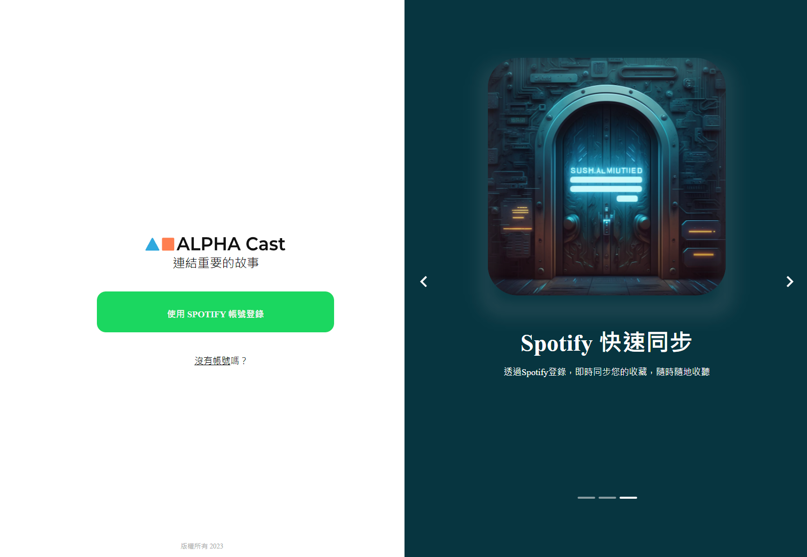

# ALPHA Cast

> ALPHA Cast 讓喜愛收聽 Podcast 的使用者，可以自訂節目分類、收藏單集，以及線上播放單集。

## Table of contents

- [Overview](#overview)
  - [The challenge](#the-challenge)
  - [Screenshot](#screenshot)
  - [Links](#links)
- [My process](#my-process)
  - [Built with](#built-with)
  - [What I learned](#what-i-learned)
  - [Continued development](#continued-development)
  - [Useful resources](#useful-resources)
- [Author](#author)

## Overview

### The challenge

Users should be able to:

- Login and get access to episode of podcast in the Spotify
- Create, delete, and edit bookmark and collect favorite episode.
- Playing episode on the spotify.

### Screenshot

### Links

- Live Site URL: [https://vite-vercel-phi-seven.vercel.app/](https://vite-vercel-phi-seven.vercel.app/)

- 體驗帳密:
  帳號:spotifytest9527@gmail.com
  密碼:#spotifyTest#9527

### Usage example

## 使用說明

### 登入 & 前往主頁面

1. 進入專案頁面
2. 點選登入 輸入體驗帳號 並 授權同意
3. 等待初始化並進入主頁面
4. 在主頁面可以執行以下操作：
   - 新增分類
   - 編輯分類名稱
   - 刪除分類

### 新增 Podcast

1. 點選分類中的「新增 Podcast」按鈕
2. 在搜尋欄輸入篩選條件
3. 選取喜歡的 Podcast
4. 按下「確定新增」

### Podcast 操作

- 點選 Podcast 的「更多」進入 episode 列表
- 點選右上角的書籤可加入收藏清單
- 點選播放圖示將其置換到正在播放
- 點選刪除從分類中刪除該 Podcast

### 收藏清單

- 已收藏的 episode 列表
- 點選書籤可將 episode 從收藏清單中移除
- 點選播放可將其置換到正在播放

## My process

### Built with

- Semantic HTML5 markup
- SASS - manage css setting
- [React Router DOM](https://reactrouter.com/en/main) - efficient to manage mutiple page
- [axios](https://www.npmjs.com/package/axios) - fetch data from API
- [React](https://reactjs.org/) - JS library

### Useful resources

- [Emoji Picker](https://www.npmjs.com/package/emoji-picker-react)

## Development resources

- [設計稿（密碼：alphacamp）](https://www.figma.com/file/yRwY6jkmQbysRBIqr7A0bv/Capstone-Podcast?type=design&node-id=0-1&mode=design)
- [Spotify for Developers - Web API Documentation](https://developer.spotify.com/documentation/web-api)
- [Spotify GitHub web-api-examples](https://github.com/spotify/web-api-examples)

## others

1.  `API Docs.md` ：了解目前的 API 規格
2.  `__tests__/` ：開發中的驗證標準

## Author

- Github - [Ming Hsu](https://github.com/GHSergio)
